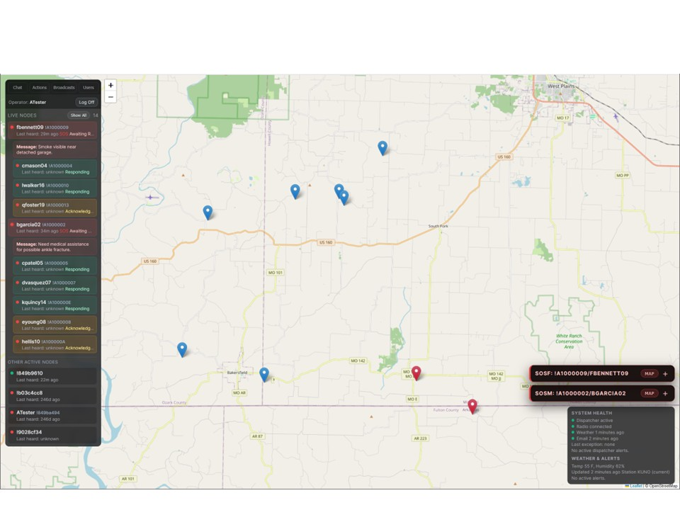
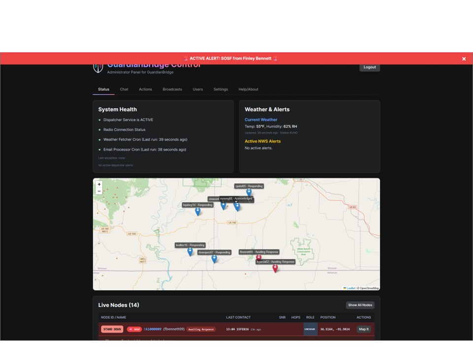
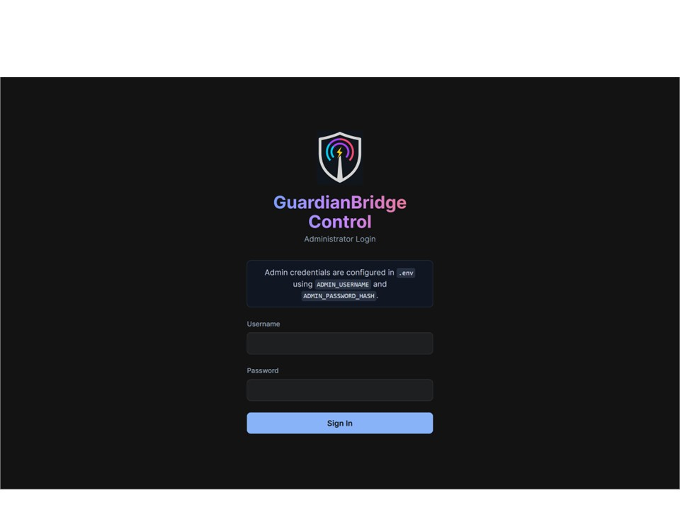
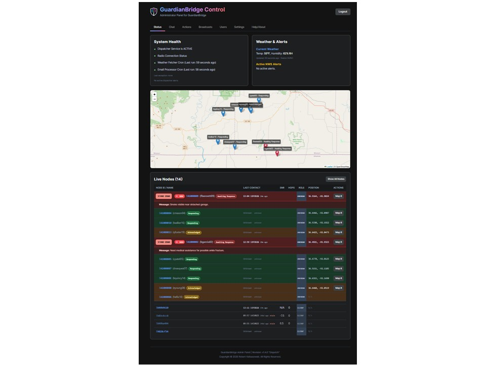
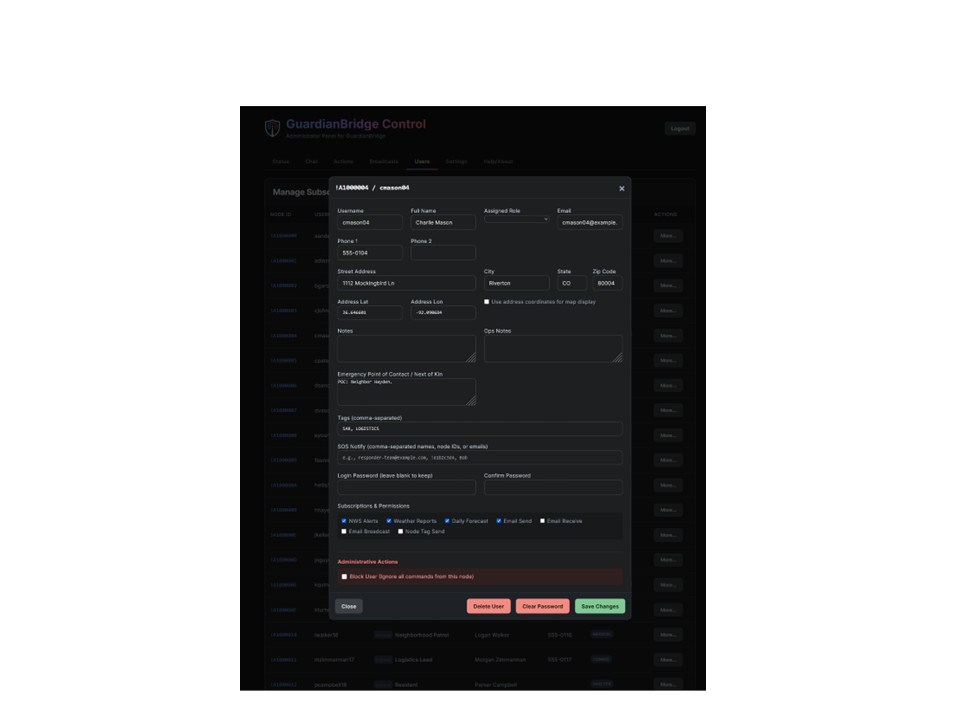
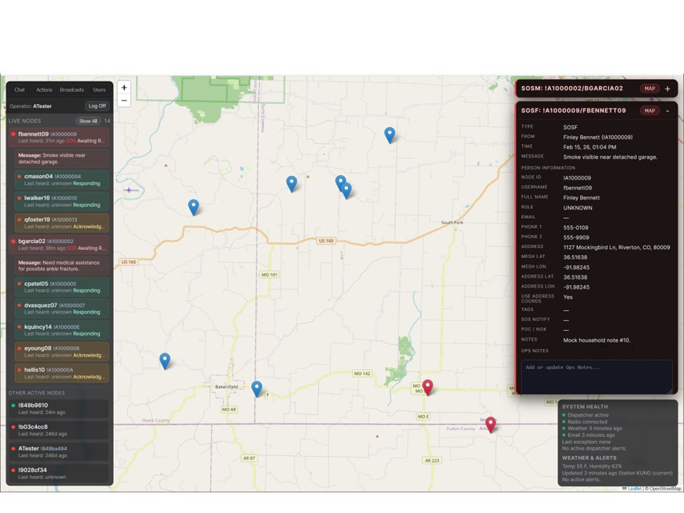
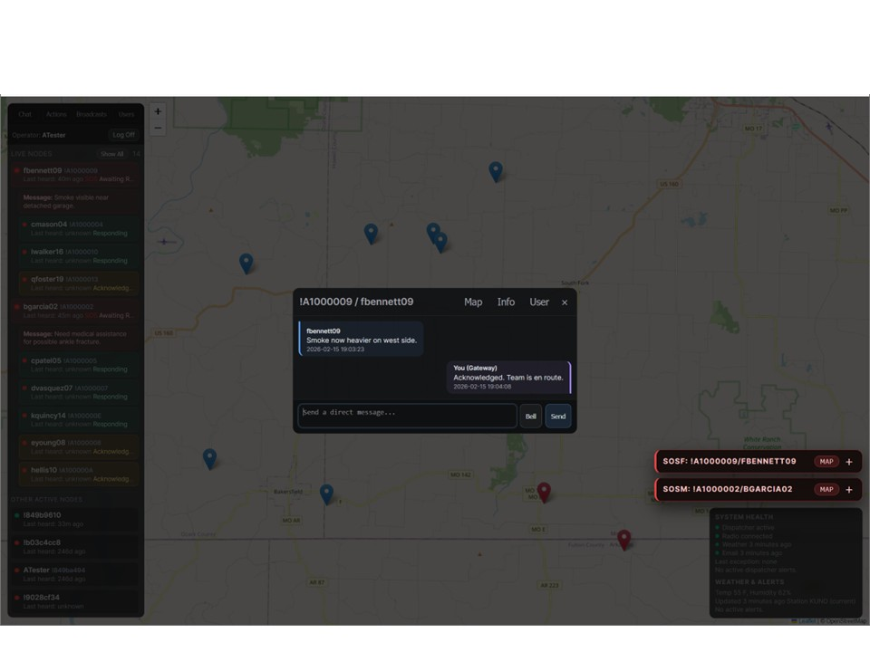

# GuardianBridge - About

MOP Home Display: The live Mesh Operator Panel view used for real-time monitoring, incident awareness, and rapid response actions.

MAP Status: The Admin Panel status dashboard showing system health, node visibility, and operational state at a glance.

GuardianBridge is a community-resilience communications suite that keeps people connected when traditional infrastructure fails. It pairs long-range LoRa mesh radios (Meshtastic) with a local server to provide messaging, alerts, and coordination even when cellular or broadband are down. When internet is available (for example, via satellite), the system bridges to email and weather services; when it is not, it still operates locally on the mesh.

## What It Is

GuardianBridge is a self-contained gateway and operations platform for Meshtastic networks. It provides:

1. Reliable, off-grid text communications over LoRa mesh.
2. Automated weather and emergency alerts.
3. A full SOS incident-response workflow.
4. A web-based admin dashboard and a live operator console.
5. Optional email bridging to and from the mesh.

The system is built to run 24/7 on low-power hardware (for example, a Raspberry Pi) and keep functioning even if parts of the stack go offline.

## Core Components

1. **Meshtastic Gateway Dispatcher** (`meshtastic_dispatcher.py`)
   - The always-on core service.
   - Listens for user commands, sends and routes messages, manages scheduled broadcasts, and coordinates SOS workflows.

2. **Weather Fetcher** (`weather_fetcher.py`)
   - Periodically pulls NWS observations, forecasts, and alerts.
   - Stores data locally for mesh broadcast and UI display.

3. **Email Processor** (`email_processor.py`)
   - Sends outgoing mesh-to-email messages.
   - Ingests incoming emails and relays them to the mesh.

4. **Mesh Admin Panel (MAP)** (`map.php`)
   - Full system management UI.
   - Live map, nodes list, SOS incident command, user management, and settings.
   - Includes a recent audit activity feed for high-impact admin actions, with JSON/CSV export and retention controls.

5. **Mesh Operator Panel (MOP)** (`mop.php`)
   - Operator-focused console for live monitoring and incident response.
   - Compact overlays, fast access to SOS tools, and live chat operations.
   - Includes a recent audit activity feed for high-impact actions, with role-scoped visibility and JSON/CSV export.

6. **API & Assets** (`www/map-items/`)
   - JSON endpoints for live node, chat, SOS, and system data.
   - Map tiles, assets, and UI dependencies.

## How It Works (High-Level)

1. Mesh radios form a self-healing LoRa network.
2. GuardianBridge listens to that mesh via the gateway radio.
3. Local services (weather fetcher, email processor) update local data and enqueue work in SQLite-backed queues.
4. The dispatcher reads those updates and broadcasts, routes, or responds.
5. Web UIs consume live data from API endpoints to visualize the system in real time.

Key design idea: components are decoupled. A failure in one part does not crash the core dispatcher.

## Practical Use Cases

1. Neighborhood emergency communications
   - Local mesh messaging between households.
   - SOS alerts with responder coordination.

2. CERT and volunteer response
   - Tag-based and temporary-group messaging.
   - Incident command view for multiple active alerts.

3. Severe weather resilience
   - Automated NWS alerts and forecasts to the mesh.
   - Local visibility even if internet drops.

4. Community hubs and shelters
   - One gateway supports many radios.
   - Admins can send broadcasts or DMs.
   - Coordinators can review recent audited actions in MAP/MOP.

5. Events and field operations
   - Command posts can manage responders and maintain live situational awareness.

## SOS and Incident Response

GuardianBridge supports a full SOS lifecycle:

1. Users can trigger SOS (general, police, fire, medical).
2. The dispatcher requests a location update and logs the event.
3. Responders with matching SOSX profile TAGs are notified and can ACK/RESPOND.
4. Operators see a live incident hierarchy (sender, responders, acknowledgers).
5. Admins can stand down an incident when resolved.

The operator console also provides:

1. A persistent SOS popup with sender details.
2. A flashing SOS banner and optional audio alerts.
3. One-click actions to open incident tools.

GuardianBridge also performs active welfare check-ins during an SOS. It periodically pings the sender and, if there is no response after multiple attempts, automatically escalates the alert as UNRESPONSIVE for responders.

## Mapping and Location

Nodes can be placed using:

1. Live mesh GPS coordinates (default).
2. Stored address coordinates (optional per user).

If address coordinates are enabled and valid, the map uses them; otherwise it falls back to mesh data.

## Security and Privacy Considerations

1. Mesh messages are encrypted end-to-end by Meshtastic.
2. The web UI requires authentication.
3. Address coordinates are optional and should be used with consent.

## Deployment Notes

1. Runs on low-power hardware.
2. Works offline on the mesh.
3. Scales from a small neighborhood to a regional volunteer network.
4. Supports optional internet bridging (email, NWS data).

## Release Operations

Recommended command sequence before a production release:

1. Preflight gate:
   - `python3 /opt/GuardianBridge/scripts/pre_release_preflight.py`
2. Build release artifact:
   - `python3 /opt/GuardianBridge/scripts/build_release_artifact.py`
3. Confirm fresh DB backup exists in `AutoBackUp/`.

Rollback procedure (single command):

1. Restore latest backup and restart service:
   - `python3 /opt/GuardianBridge/scripts/rollback_guardianbridge.py --yes`
2. To select a specific backup:
   - `python3 /opt/GuardianBridge/scripts/rollback_guardianbridge.py --list-backups`
   - `python3 /opt/GuardianBridge/scripts/rollback_guardianbridge.py --backup-file /opt/GuardianBridge/AutoBackUp/guardianbridge_db_YYYYMMDD_HHMMSS.db --yes`

## Quick Feature List

1. Live map + node list
2. SOS incident command
3. Operator console (MOP)
4. Two-way email relay
5. Automated weather + alerts
6. Tag-based group messaging
7. Temporary groups with auto-expiry
8. Scheduled broadcasts
9. Offline-first design
10. Audit trail with export + retention

## Over-Mesh User Commands

Below are the user-facing commands that can be sent as Direct Messages to the gateway over the mesh, and what each does. For structured commands, you can use either `/` or `,` as separators (spaces after separators are accepted but not required).

1. `help` or `?` - Shows a list of available commands. Examples: `help`, `?`
2. `subscribe` - Subscribes you to all automated broadcasts. Example: `subscribe`
3. `unsubscribe` - Unsubscribes you from all broadcasts. Example: `unsubscribe`
4. `status` - Shows your current name, subscription settings, and assigned tags. Example: `status`
5. `alerts on` / `alerts off` - Toggles NWS weather alerts. Examples: `alerts on`, `alerts/on`, `alerts,on`, `alerts, on`
6. `weather on` / `weather off` - Toggles periodic current weather updates. Examples: `weather off`, `weather/off`, `weather,off`, `weather, off`
7. `forecasts on` / `forecasts off` - Toggles scheduled daily forecasts. Examples: `forecasts on`, `forecasts/on`, `forecasts,on`, `forecasts, on`
8. `wx` - Instantly fetches the current or next upcoming forecast. Example: `wx`
9. `name/YourName` - Registers or updates your display name (single word). Examples: `name/Alice`, `name,Alice`, `name, Alice`, `name Alice`
10. `phone/1/number` or `phone/2/number` - Sets one of your two phone numbers. Examples: `phone/1/555-1234`, `phone,1,555-1234`, `phone/1,555-1234`, `phone,1/555-1234`
11. `address/Street, City, ST ZIP` or `address/street|city|state|zip` - Stores your physical address in structured form. Examples: `address/123 Main St, Anytown, LA 70001`, `address,123 Main St, Anytown, LA 70001`, `address/123 Main St|Anytown|LA|70001`, `address,123 Main St|Anytown|LA|70001`
12. `email/to/subj/body` - Sends an email through the gateway. Examples: `email/friend@test.com/Status/We are safe`, `email,friend@test.com,Status,We are safe`, `email/friend@test.com,Status,We are safe`, `email,friend@test.com/Status/We are safe`
13. `tagsend/TAG1 TAG2/Message` - Sends a message to one or more groups. Permanent tags require `node_tag_send` permission; temporary groups do not. Examples: `tagsend/CERT MEDICAL/Meeting at 1800`, `tagsend,CERT MEDICAL,Meeting at 1800`, `tagsend,CERT MEDICAL,Meeting at 1800`, `tagsend,CERT MEDICAL/Meeting at 1800`
14. `tagin/TAGNAME` - Join a group channel. If the group is a permanent tag, you must already have that tag; otherwise a temporary group is created/joined automatically. Examples: `tagin/CERT`, `tagin,CERT`, `tagin TEAMUP`
15. `tagout` - Exit the tag channel and return to normal messaging. Example: `tagout`
16. `tagshut/GROUPNAME` - Admin only. Locks a temporary group and blocks temporary-group activity until reopened. Examples: `tagshut/TEAMUP`, `tagshut,TEAMUP`
17. `tagopen/GROUPNAME` - Admin only. Reopens a previously locked temporary group. Examples: `tagopen/TEAMUP`, `tagopen,TEAMUP`
18. `tagkill/GROUPNAME` - Admin only. Immediately deletes a temporary group and clears active-channel assignment for users on it. Examples: `tagkill/TEAMUP`, `tagkill,TEAMUP`
19. `SOS` / `SOSP` / `SOSF` / `SOSM` - Triggers an emergency alert (General, Police, Fire, Medical). Can include a message. Example: `SOSM Need medical assistance`
20. `CLEAR` / `CANCEL` / `SAFE` - Clears your active emergency alert. Example: `SAFE`
21. `ACK` - Acknowledge an active SOS alert. Examples: `ACK`, `ACK 2`
22. `RESPONDING` - Mark yourself as responding to an active SOS alert. Examples: `RESPONDING`, `RESPONDING 2`
23. `active` or `alertstatus` - Lists all currently active SOS alerts. Examples: `active`, `alertstatus`
24. `block/email@addr.com` - Admin only. Adds an email address to the blocklist. Examples: `block/spam@example.com`, `block,spam@example.com`, `block spam@example.com`
25. `unblock/email@addr.com` - Admin only. Removes an email address from the blocklist. Examples: `unblock/spam@example.com`, `unblock,spam@example.com`, `unblock spam@example.com`
26. `hello` or `hi` - Returns server name/version, local server time, current weather, and forecast. Examples: `hello`, `hi`

Temporary groups are stored separately from permanent profile tags and automatically close after inactivity based on `TEMP_GROUP_TTL_DAYS` (default: 14 days). Activity includes join, leave, and send events. Admins can control temporary-group state with `tagshut`, `tagopen`, and `tagkill`.

MAP and MOP chat refresh now prefers an event-stream path with automatic fallback to polling when streaming is unavailable.

Dispatcher command jobs run from SQLite with retry/backoff, leasing, duplicate-suppression receipts, and dead-letter metadata for invalid payloads.

MAP and MOP include dead-letter queue management in Actions (requeue/delete), and health panels now expose dispatcher alerts, queue depth/backlog signals, and latest exception details.

MAP and MOP manual service triggers (weather fetch, email processing) plus MAP database maintenance (backup/restore/vacuum) are now queued as SQLite dispatcher command jobs for safer execution without web-side service control.

## Appendix: About Image Notes

This is the administrative authentication boundary for the web control plane. Friendly in layout but strict in effect, it protects privileged operations that can alter queue state, subscriber records, and runtime behavior.

This view packages advanced health and freshness signals into a readable operator dashboard. It helps teams verify that background jobs are current and that queue or service anomalies are detected early.

This editor is where subscriber metadata becomes operationally useful data. Accurate profile, coordinate, and contact fields improve routing decisions, map rendering quality, and SOS responder context.

This is the live operations surface for fast situational awareness. It merges map state, node activity, and service health in a way that supports quick technical decisions without overwhelming the operator.

The SOS panel is optimized for incident urgency and response velocity. It keeps critical alert context visible so acknowledgement and escalation actions can happen quickly and consistently.

This direct-message path is the precise channel for user-specific coordination. It is especially helpful for technical triage, targeted instructions, and confirmation loops that should not appear in public channel traffic.
